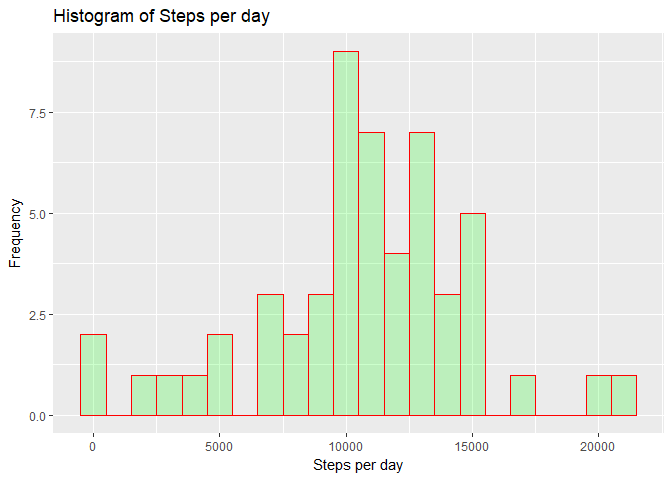
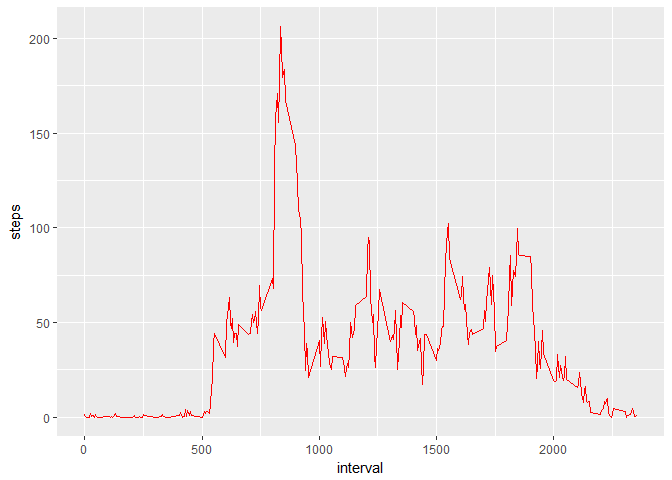
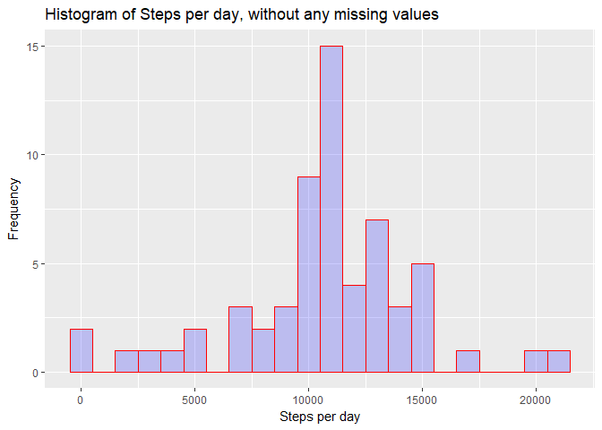
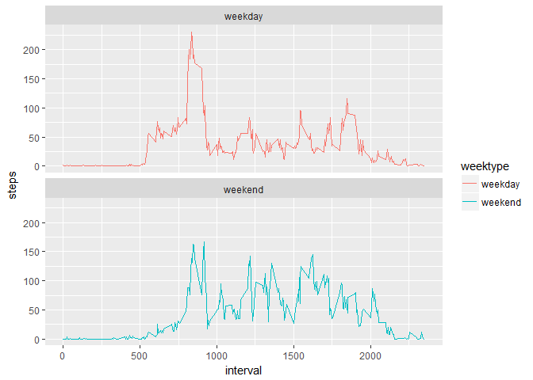

# Reproducible Research - Course Project 1
Vijay Gurram  
3 October 2017  
  

```r
knitr::opts_chunk$set(echo = TRUE)
```


## Introduction


This document is generated as part of the assignment for the Coursera course **Reproducible Research**. This document contains the description of the assignment and the procedure that is followed to address the questions by showing the results and the corresponding the code that produced those results together.

This assignment makes use of data from a personal activity monitoring device. This device collects data at 5 minute intervals throughout the day. The data consists of two months of data from an anonymous individual collected during the months of October and November, 2012 and include the number of steps taken in 5 minute intervals each day.

Please refer to the **Readme** document for the details of the assignment along with the questions that we are trying to address. 

*Note: Please ensure the data file is available in the present working directory* 

###Loading the necessary packages


```r
library(dplyr)
```

```
## Warning: package 'dplyr' was built under R version 3.4.1
```

```
## 
## Attaching package: 'dplyr'
```

```
## The following objects are masked from 'package:stats':
## 
##     filter, lag
```

```
## The following objects are masked from 'package:base':
## 
##     intersect, setdiff, setequal, union
```

```r
library(knitr)
library(ggplot2)
```

```
## Warning: package 'ggplot2' was built under R version 3.4.1
```

```r
library(lubridate)
```

```
## Warning: package 'lubridate' was built under R version 3.4.1
```

```
## 
## Attaching package: 'lubridate'
```

```
## The following object is masked from 'package:base':
## 
##     date
```

###Loading the data file and checking the contents


```r
activityData <- read.csv("activity.csv", header = TRUE)
summary(activityData)
```

```
##      steps                date          interval     
##  Min.   :  0.00   2012-10-01:  288   Min.   :   0.0  
##  1st Qu.:  0.00   2012-10-02:  288   1st Qu.: 588.8  
##  Median :  0.00   2012-10-03:  288   Median :1177.5  
##  Mean   : 37.38   2012-10-04:  288   Mean   :1177.5  
##  3rd Qu.: 12.00   2012-10-05:  288   3rd Qu.:1766.2  
##  Max.   :806.00   2012-10-06:  288   Max.   :2355.0  
##  NA's   :2304     (Other)   :15840
```

```r
str(activityData)
```

```
## 'data.frame':	17568 obs. of  3 variables:
##  $ steps   : int  NA NA NA NA NA NA NA NA NA NA ...
##  $ date    : Factor w/ 61 levels "2012-10-01","2012-10-02",..: 1 1 1 1 1 1 1 1 1 1 ...
##  $ interval: int  0 5 10 15 20 25 30 35 40 45 ...
```

```r
head(activityData)
```

```
##   steps       date interval
## 1    NA 2012-10-01        0
## 2    NA 2012-10-01        5
## 3    NA 2012-10-01       10
## 4    NA 2012-10-01       15
## 5    NA 2012-10-01       20
## 6    NA 2012-10-01       25
```

```r
tail(activityData)
```

```
##       steps       date interval
## 17563    NA 2012-11-30     2330
## 17564    NA 2012-11-30     2335
## 17565    NA 2012-11-30     2340
## 17566    NA 2012-11-30     2345
## 17567    NA 2012-11-30     2350
## 17568    NA 2012-11-30     2355
```

As now we have understood the data, let's proceed with the questions.

**Proceeding to address the questions now...**


###What is mean total number of steps taken per day?

For this part of the assignment the missing values can be ignored.


*1.Calculate the total number of steps taken per day.*


```r
stepsbyDate <- activityData %>% filter(!is.na(steps)) %>% group_by(date) %>% 
    summarise(steps = sum(steps)) %>% print(stepsbyDate)
```

```
## Warning: package 'bindrcpp' was built under R version 3.4.1
```

```
## # A tibble: 53 x 2
##          date steps
##        <fctr> <int>
##  1 2012-10-02   126
##  2 2012-10-03 11352
##  3 2012-10-04 12116
##  4 2012-10-05 13294
##  5 2012-10-06 15420
##  6 2012-10-07 11015
##  7 2012-10-09 12811
##  8 2012-10-10  9900
##  9 2012-10-11 10304
## 10 2012-10-12 17382
## # ... with 43 more rows
```


*2.Make a histogram of the total number of steps taken each day.*


```r
ggplot(stepsbyDate, aes(x = steps)) + geom_histogram(col="red", fill="green", alpha = .2, binwidth = 1000) +
  labs(title = "Histogram of Steps per day", x = "Steps per day", y = "Frequency")
```

<!-- -->


*3.Calculate and report the mean and median of the total number of steps taken per day.*


```r
meanSteps <- mean(stepsbyDate$steps, na.rm = TRUE)
print( meanSteps)
```

```
## [1] 10766.19
```

```r
medianSteps <- median(stepsbyDate$steps, na.rm = TRUE)
print(medianSteps)
```

```
## [1] 10765
```

Mean steps taken = **10766**

Median steps taken = **10765**


###What is the average daily activity pattern?


*1.Make a time series plot (i.e. type = "l") of the 5-minute interval (x-axis) and the average number of steps taken, averaged across all days (y-axis)*


```r
interval <- activityData %>% filter(!is.na(steps)) %>% group_by(interval) %>%
  summarize(steps = mean(steps))

ggplot(interval, aes(x=interval, y=steps)) +
  geom_line(color = "red")
```

<!-- -->


*2.Which 5-minute interval, on average across all the days in the dataset, contains the maximum number of steps?*


```r
maxInterval <- interval[which.max(interval$steps),]
print(maxInterval)
```

```
## # A tibble: 1 x 2
##   interval    steps
##      <int>    <dbl>
## 1      835 206.1698
```

The interval **835** contains maximum number of steps.


###Imputing missing values

Note that there are a number of days/intervals where there are missing values (coded as NA). The presence of missing days may introduce bias into some calculations or summaries of the data.


*1.Calculate and report the total number of missing values in the dataset (i.e. the total number of rows with NAs)*


```r
mv <- sum(is.na(activityData$steps))
print(mv)
```

```
## [1] 2304
```

We have a total of **2304** missing values in the dataset.


*2.Devise a strategy for filling in all of the missing values in the dataset. The strategy does not need to be sophisticated. For example, you could use the mean/median for that day, or the mean for that 5-minute interval, etc.*

We will use **mean for that 5-minute interval** to fill the missing value


*3.Create a new dataset that is equal to the original dataset but with the missing data filled in.*


```r
nomvData <- activityData
mv <- is.na(activityData$steps)
avg_interval <- tapply(nomvData$steps, nomvData$interval, mean, na.rm=TRUE, simplify=TRUE)
nomvData$steps[mv] <- avg_interval[as.character(nomvData$interval[mv])]
```


and check whether the filling action is successful


```r
mv <- sum(is.na(nomvData$steps))
print(mv)
```

```
## [1] 0
```

As we see there are no missing values in the dataset.


*4.Make a histogram of the total number of steps taken each day and Calculate and report the mean and median total number of steps taken per day. Do these values differ from the estimates from the first part of the assignment? What is the impact of imputing missing data on the estimates of the total daily number of steps?*


```r
nomvSteps <- nomvData %>%
  filter(!is.na(steps)) %>%
  group_by(date) %>%
  summarize(steps = sum(steps)) %>%
  print(nomvSteps)
```

```
## # A tibble: 61 x 2
##          date    steps
##        <fctr>    <dbl>
##  1 2012-10-01 10766.19
##  2 2012-10-02   126.00
##  3 2012-10-03 11352.00
##  4 2012-10-04 12116.00
##  5 2012-10-05 13294.00
##  6 2012-10-06 15420.00
##  7 2012-10-07 11015.00
##  8 2012-10-08 10766.19
##  9 2012-10-09 12811.00
## 10 2012-10-10  9900.00
## # ... with 51 more rows
```

```r
ggplot(nomvSteps, aes(x = steps)) + 
  geom_histogram(col="red", fill="blue", alpha = .2, binwidth = 1000) +
  labs(title = "Histogram of Steps per day, without any missing values", x = "Steps per day", y = "Frequency")
```

<!-- -->


calculating the mean and median for the no missing value dataset


```r
meanSteps <- mean(nomvSteps$steps, na.rm = TRUE)
print( meanSteps)
```

```
## [1] 10766.19
```

```r
medianSteps <- median(nomvSteps$steps, na.rm = TRUE)
print(medianSteps)
```

```
## [1] 10766.19
```

Mean steps taken = **10766**

Median steps taken = **10766**


*The impact of inputting the missing data is that value of both mean and median become same.*


###Are there differences in activity patterns between weekdays and weekends?###

For this part the weekdays() function may be of some help here. Use the dataset with the filled-in missing values for this part.


*1.Create a new factor variable in the dataset with two levels - "weekday" and "weekend" indicating whether a given date is a weekday or weekend day.*


```r
nomvData <- mutate(nomvData, weektype = ifelse(weekdays(as.POSIXct(nomvData$date)) == "Saturday" | weekdays(as.POSIXct(nomvData$date)) == "Sunday", "weekend", "weekday"))
nomvData$weektype <- as.factor(nomvData$weektype)
head(nomvData)
```

```
##       steps       date interval weektype
## 1 1.7169811 2012-10-01        0  weekday
## 2 0.3396226 2012-10-01        5  weekday
## 3 0.1320755 2012-10-01       10  weekday
## 4 0.1509434 2012-10-01       15  weekday
## 5 0.0754717 2012-10-01       20  weekday
## 6 2.0943396 2012-10-01       25  weekday
```


*2.Make a panel plot containing a time series plot (i.e. type = "l") of the 5-minute interval (x-axis) and the average number of steps taken, averaged across all weekday days or weekend days (y-axis).*


```r
byInterval <- nomvData %>%
  group_by(interval, weektype) %>%
  summarise(steps = mean(steps))
```

```r
ggplot(byInterval, aes(x=interval, y=steps, color = weektype)) + geom_line() +
   facet_wrap(~weektype, ncol = 1, nrow=2)
```

<!-- -->


**From these two plots it is observed that there is more activity during the weekend than the weekday.**
